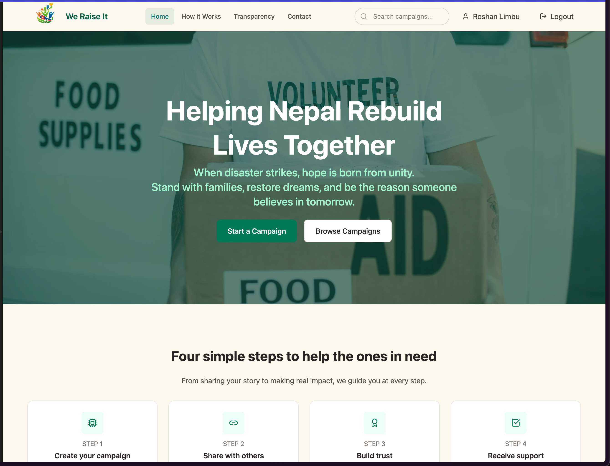

# Team Zeroth — Codefest 2025 Donation Platform



Overview
--------
This repository implements a donation/crowdfunding platform built during Codefest 2025 by Team Zeroth. It contains a Node/TypeScript backend (API + Prisma ORM) and a React frontend (Vite). The app supports user authentication, campaign creation, donations (including Khalti integration), KYC flows, admin routes, and file uploads.

Key Features
------------
- User authentication (signup / login / x-xsrf tokens)
- Campaign creation and management
- Donation processing (Khalti integration)
- KYC fields and verification workflows
- Admin routes for moderation and campaign management
- Prisma for database modelling and migrations

Repository Structure
--------------------
- `backend/` — Node + TypeScript API, Prisma schema and migrations, controllers, routes and services.
- `frontend/` — React (Vite) SPA, components, API client, pages and UI.
- `backend/prisma/` — `schema.prisma`, migration history, generated client.
- `backend/uploads/` — local storage for uploaded assets.
- Documentation files: `admin-routes.md`, `auth-routes.md`, `campaign-routes.md`, `kyc-routes.md`, `profile-routes.md`, `apidoc.md`.

Quick Start (local)
-------------------
Requirements:
- Node.js (16+ recommended)
- A PostgreSQL (or supported) database for Prisma

1) Backend

```bash
cd backend
npm install
# copy or create a .env file with required env vars (see below)
npx prisma generate
npx prisma migrate dev --name init
npm run dev
```

2) Frontend

```bash
cd frontend
npm install
npm run dev
```

Environment variables (examples)
--------------------------------
Create a `.env` in `backend/` with at least:

- `DATABASE_URL` — your database connection string
- `JWT_SECRET` — secret used to sign JWTs
- `KHALTI_SECRET` — Khalti config/secret if using Khalti payments
- Any other provider keys used in controllers (check `backend/src/controllers`)

Database & Prisma
-----------------
- Schema is in `backend/prisma/schema.prisma` and migrations are in `backend/prisma/migrations`.
- Use `npx prisma migrate dev` for local development and `npx prisma generate` to regenerate the client when schema changes.

API Documentation
-----------------
Route and API details are documented in the repository:
- `admin-routes.md`
- `auth-routes.md`
- `campaign-routes.md`
- `kyc-routes.md`
- `profile-routes.md`
- `apidoc.md`

Development Notes
-----------------
- The backend TS entrypoint is `backend/src/index.ts`.
- Controllers live in `backend/src/controllers/` and routes in `backend/src/routes/`.
- The frontend entry is `frontend/src/main.jsx` and pages/components are under `frontend/src/components/`.
- Uploaded files are stored in `backend/uploads/` — ensure write permissions.

Deployment
----------
- Prepare environment variables and a production database.
- Run Prisma migrations (`prisma migrate deploy`) during deployment.
- Build the frontend (`npm run build` in `frontend`) and serve statically (or via Vite preview / CDN).


Where to Find More
------------------
- Backend source: `backend/src/`
- Frontend source: `frontend/src/`
- Prisma schema & migrations: `backend/prisma/`
- API docs: `admin-routes.md`, `auth-routes.md`, `campaign-routes.md`, `kyc-routes.md`, `profile-routes.md`, `apidoc.md`

